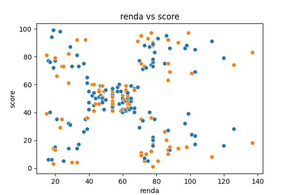
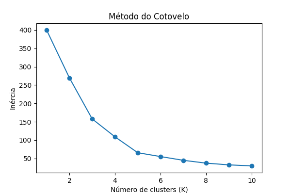
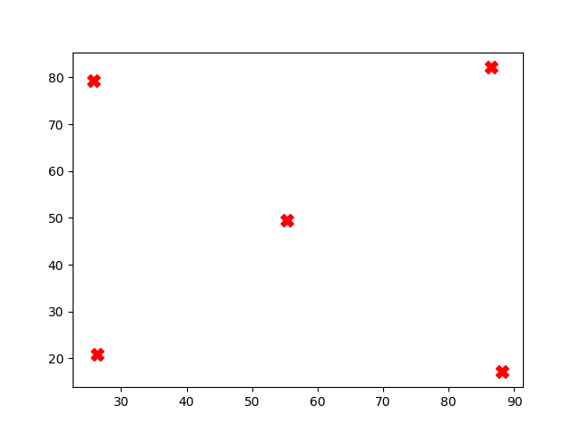
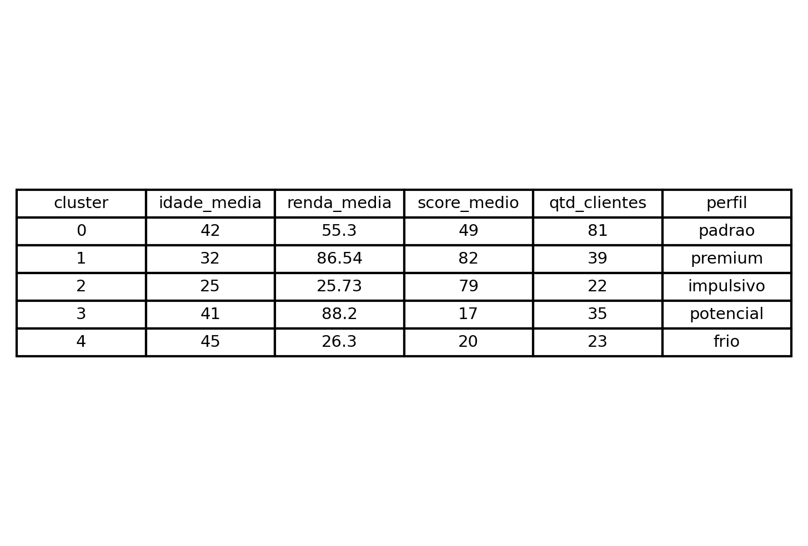

🛍️ Segmentação de clientes de shopping

autor: Maylson Maia
____________________________________________________

🎯 Solução de negócio

Empresas de varejo precisam entender melhor o comportamento dos seus clientes para direcionar estratégias de marketing, retenção e aumento de receita.

Este projeto buscou segmentar clientes de um shopping com base em renda e comportamento de consumo, identificando grupos com perfis distintos para apoiar decisões estratégicas.
__________________________________
📊 Sobre os Dados

A base contém 200 clientes, com as seguintes variáveis:

Idade

Gênero

Renda Anual (k$)

Spending Score (pontuação de consumo de 0 a 100)

- não foram identificados valores nulos ou inconsistentes.
____________________________________________________________

⚙️ Metodologia

O projeto seguiu o seguinte fluxo:

Entendimento dos dados

Análise exploratória (EDA)

Pré-processamento (padronização das variáveis)

Escolha do número ideal de clusters (técnicas: Elbow + Silhouette)

Treinamento do modelo K-Means

Interpretação dos clusters

Geração de insights de negócio
__________________________________________________________________________

🔎 Análise Exploratória (EDA)

Foram analisadas distribuições, correlações e relações entre variáveis.

Principais achados:

Clientes mais jovens tendem a ter maior spending score

Renda e score não possuem forte correlação linear, porém existem padrões visuais claros de segmentação entre essas variáveis

_______________________________________________________________________________

🤖 Modelagem

Foi utilizado o algoritmo K-Means para segmentação.

Dados padronizados com StandardScaler

Número de clusters definido como K = 5

Validação com Silhouette Score ≈ 0.55

__________________________________________________________________________________

📈 Resultado da Segmentação

Foram identificados 5 grupos distintos de clientes.

💡 Perfis dos Clientes
Cluster	Perfil
0	Renda média, consumo médio (cliente padrão)
1	Alta renda, alto consumo (cliente premium)
2	Baixa renda, alto consumo (cliente impulsivo)
3	Alta renda, baixo consumo (cliente potencial)
4	Baixa renda, baixo consumo (cliente frio)

_______________________________________________________________________
💼 Insights de Negócio

A segmentação permite ações estratégicas como:

Programa VIP para cliente premium

Campanhas de ativação para clientes potenciais de oportunidade

Promoções para clientes impulsivos

Redução de investimento em segmentos de baixo valor

______________________________________________________________________________

🧾 Conclusão

A aplicação de técnicas de clusterização permitiu transformar dados de clientes em insights estratégicos acionáveis, possibilitando decisões mais eficientes em marketing, retenção e crescimento de receita.
_________________________________________________________________________

🚀 Próximos Passos

Testar inclusão da variável idade no modelo, com faixas de idade

Testar outros algoritmos de clusterização

Criar campanhas personalizadas por cluster

Aplicar o modelo em novos dados de clientes
_____________________________________________________________________

🛠️ Tecnologias Utilizadas

Python

Pandas

NumPy

Matplotlib / Seaborn

Scikit-learn
